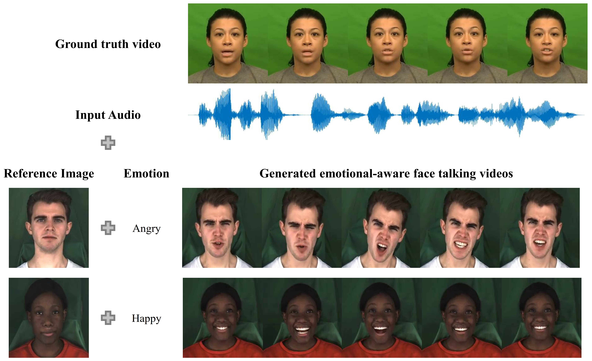
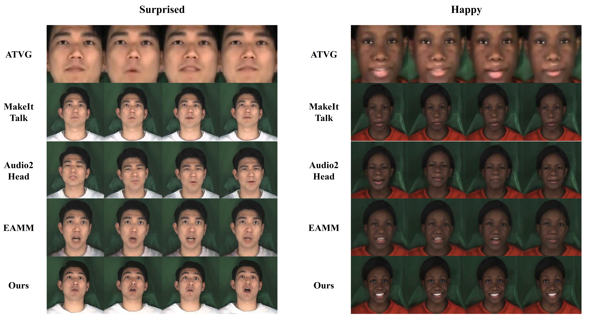

# Emotion-aware face-talking generation
 Our method learns identity information from the reference image and the audio by extracting relevant features and projecting them into the same latent space. Emotions are input in text form and features are extracted using a pretrained transformer model. Features are concatenated and fed into the landmarks decoder, which predicts landmark displacements. To reduce the noise and sudden movements between consecutive frames, we use an attention mechanism that takes as input a sequence of predicted landmarks. Lastly, an image generator module is employed to generate high-quality video frames

## Run
* Landmarks to image recontruction
Train model to generate images from landmarks and a reference image
```bash
python main_land2img.py --lmrks_train <path>  --lmrks_val <path> 
```
* Inference
  Generate emotion aware videos from audio
```bash
python main_land2img.py --audio_file <path>  --img_ref_file <path> --output_file <path> 
```
## Results


